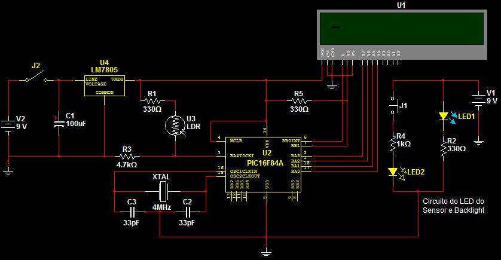

# BikeSpeedometer
An old project of a speedometer written in assembly for PIC 16F84A

## Projeto
Trata-se de um **velocímetro para bicicleta** que utiliza de um sensor na roda da bicicleta e um LCD de 2 linhas para exibir a informação obtida. Para isso foi utilizado como cérebro do projeto um **PIC 16F84A**.

#### Arquivos
- **prepara.asm**: funciona como um header para o arquivo contendo o loop principal
- **main.asm**: possui o loop principal, coordenando as funcionalidades criadas no arquivo _prepara.asm_.
- **bill of materials**: lista de materiais para construção do projeto
- **BVP**: arquivo para o MultiSIM10 contendo o esquemático do projeto (há a imagem do mesmo no final deste README).

## Motivação
De forma resumida, este projeto foi realizado no ano de 2008 com objetivo de utilizar conhecimentos adquiridos durante um curso para programação assembly em microcontroladores PIC. Para isso a idéia foi realizar um projeto pessoal de um **velocímetro para bicicleta**.

## Pasta "Docs"
- Aqui há arquivos que guiaram o projeto, mas trata-se apenas de um **esboço**, não havendo preocupação em seguir normas ABNT e afins.
- Não são documentos revisados, por tanto podem haver partes incompletas, erros de digitação, entre outros, mas que não prejudicam o entendimento dos mesmos.
#### Arquivos Relevantes
- O arquivo **Documento Geral do Projeto Bike Velocimeter.doc** contém todo o escopo do projeto sendo um ponto de partida para entendimento do mesmo.
- O arquivo **Software Doc to Bike Velocimeter Project.doc** contém todo o código desenvolvido em assembly com algumas notas adicionais. Nele também são encontradas partes separadas dos códigos desenvolvidos para solução de cada problema encontrado durante a resolução do projeto.
-  - O arquivo **mapeamento da RAM.xls** é uma planilha com a visão geral do mapeamento da RAM  do **PIC16f84A** utilizado no projeto.

## Pasta "Img"
- Possui imagens do projeto: esquemáticos, PCB, plano de uso da tela de LCD, e até um protótipo de 'holder' para o projeto feito no **AutoCAD**.
#### Circuito Final

_além do circuito final há outros arquivos relevantes na pasta_.

#### Projeto em Funcionamento

