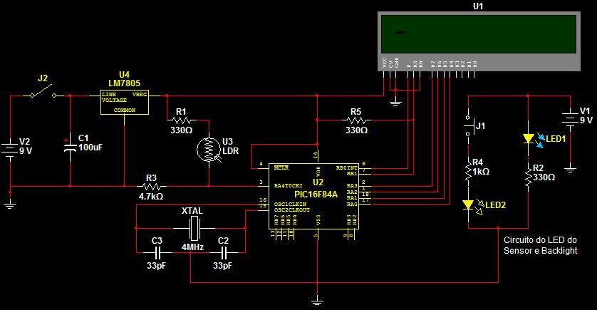

# BikeSpeedometer
An old project of a speedometer written in assembly for PIC 16F84A.

## Project

It's a **bicycle speedometer** that has a sensor at the bicycle wheel  and a 2 lines LCD display to show the obtained information. The "brain" of this project is a **PIC 16F84A** microcontroller.

## Files

- **prepara.asm**: works as a header file for tha main loop file.
- **main.asm**: has the main loop, coordinating the functions created in _prepara.asm_.
- **bill of materials**: materials and components for building the project.
- **BVP**: MultiSIM (ver. 10) file containing the schematic. (there is an image below in this file).

## Motivation
In short, this project was build in 2008 with the goal on using acquired knowledges during an assembly programming for PIC microcontroller course. To get this, my ideia was to make a personal project of this bicycle speedometer.

## "Docs" folder
- Here we have some files that guided the project, but its just a scratch not worrying about following technical document rules or something else.

- Aren't revised documents, so can be found some incomplete parts, typo errors and so on, but all of this doesn't mess its understanding.

## Relevant files
- The file **"Documento Geral do Projeto Bike Velocimeter.doc"** (General document of Bike Velocimeter project) contains whole view of the project, it's a good start to understand it.
- The file **"Software Doc to Bike Velocimeter Project.doc"**  contains all the assembly code developed with some additional notes. On this, you can find separated parts of the code developed to solve each problem found during the project resolution.
- The file  **"mapeamento da RAM.xls"** (RAM mapping) is a spreadsheet with the general view of RAM mapping of **PIC16F84A** used on this project.

## "Img" folder
- It has images of the project: electronic schematics, PCB, LCD display use plan, a CAD package for the project made using **AutoCAD** software.

#### Final circuit

_besides final circuit it has other relevant files in this folder_

#### Working project
